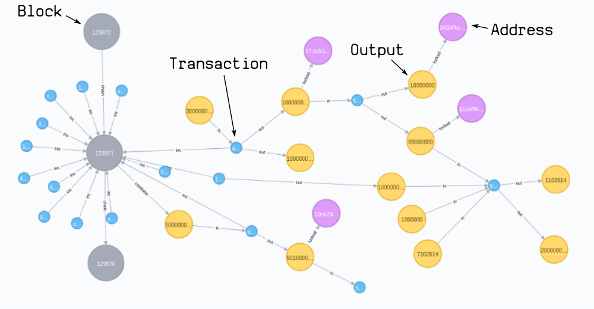
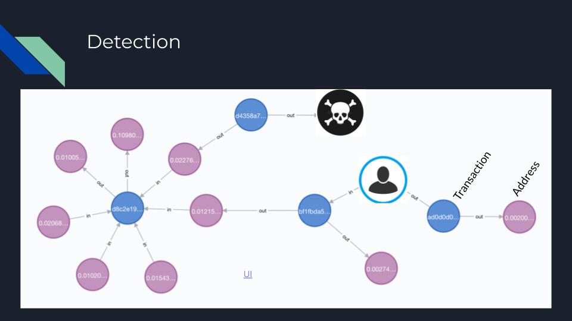
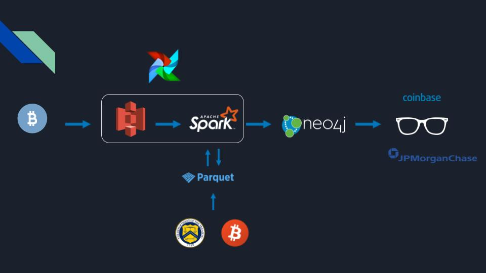
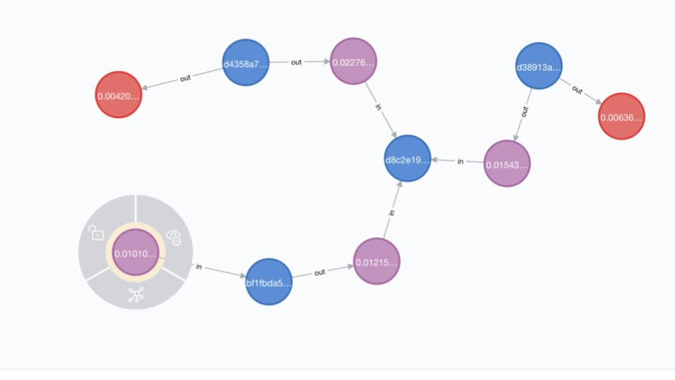
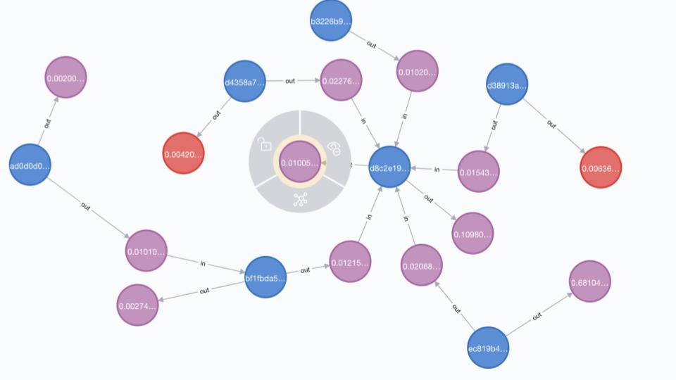

# BitInsight

Enabling detection of addresses linked to blacklisted Bitcoins.
 
Compliance teams at exchanges and financial institutions can leverage this tool when onboarding new clients to comply with regulations.

A graph visualization of the Bitcoin blockchain enables easy tracking and pattern finding for suspicious transactions.

This solutions is offered for Bitcoin but would easily be transferable to other cryptocurrencies such as Ethereum or Litecoin.

# Table of Contents
1. [Motivation](README.md#Motivation)
2. [Dataset](README.md#Dataset)
3. [Pipeline](README.md#Pipeline)
4. [Installation](README.md#Installation)
5. [Visualization](README.md#Web-App)
6. [Next steps](README.md#Next)

## Motivation

Bitcoin is a new asset class that has been growing exponentially over the past 10 years.

Today its market cap stands of over 120 billion dollars, there are more than 50 millions active users and  over half a billion transactions have been recorded on chain.

Unfortunately, the relative anonymity it offers has given way to scams, illicit activities and money laundering.

This has attracted the scrutiny of the government leading to more stringent compliance regulation.

There are many Blockchain explorers out there based on relational databases, and while they are great to explore the content of blocks and transactions, they don't offer an easy way to link them together.

Our pipeline imports the Blockchain in a graph database that will allow easy tracking and pattern analysis of transactions.

Compliance teams are then able to easily query and visualize links to blacklisted bitcoins when onboarding new clients.
   

## Dataset

### Bitcoin Historical Data

The whole Blockchain up to now (640,000 Blocks as of Sep 2020) represents 300GB of raw data and 2.6TB when deserialized to JSON format.

The JSON format of each block is presented below as an example for `block 100000`

```buildoutcfg
{
        "hash": "000000000003ba27aa200b1cecaad478d2b00432346c3f1f3986da1afd33e506",
        "confirmations": 552190,
        "strippedsize": 957,
        "size": 957,
        "weight": 3828,
        "height": 100000,
        "version": 1,
        "versionHex": "00000001",
        "merkleroot": "f3e94742aca4b5ef85488dc37c06c3282295ffec960994b2c0d5ac2a25a95766",
        "tx": [
            {
                "txid": "8c14f0db3df150123e6f3dbbf30f8b955a8249b62ac1d1ff16284aefa3d06d87",
                "hash": "8c14f0db3df150123e6f3dbbf30f8b955a8249b62ac1d1ff16284aefa3d06d87",
                "version": 1,
                "size": 135,
                "vsize": 135,
                "weight": 540,
                "locktime": 0,
                "vin": [
                    {
                        "coinbase": "044c86041b020602",
                        "sequence": 4294967295
                    }
                ],
                "vout": [
                    {
                        "value": 50,
                        "n": 0,
                        "scriptPubKey": {
                            "asm": "041b0e8c2567c12536aa13357b79a073dc4444acb83c4ec7a0e2f99dd7457516c5817242da796924ca4e99947d087fedf9ce467cb9f7c6287078f801df276fdf84 OP_CHECKSIG",
                            "hex": "41041b0e8c2567c12536aa13357b79a073dc4444acb83c4ec7a0e2f99dd7457516c5817242da796924ca4e99947d087fedf9ce467cb9f7c6287078f801df276fdf84ac",
                            "reqSigs": 1,
                            "type": "pubkey",
                            "addresses": [
                                "1HWqMzw1jfpXb3xyuUZ4uWXY4tqL2cW47J"
                            ]
                        }
                    }
                ],
                "hex": "01000000010000000000000000000000000000000000000000000000000000000000000000ffffffff08044c86041b020602ffffffff0100f2052a010000004341041b0e8c2567c12536aa13357b79a073dc4444acb83c4ec7a0e2f99dd7457516c5817242da796924ca4e99947d087fedf9ce467cb9f7c6287078f801df276fdf84ac00000000"
            },
            {
                "txid": "fff2525b8931402dd09222c50775608f75787bd2b87e56995a7bdd30f79702c4",
                "hash": "fff2525b8931402dd09222c50775608f75787bd2b87e56995a7bdd30f79702c4",
                "version": 1,
                "size": 259,
                "vsize": 259,
                "weight": 1036,
                "locktime": 0,
                "vin": [
                    {
                        "txid": "87a157f3fd88ac7907c05fc55e271dc4acdc5605d187d646604ca8c0e9382e03",
                        "vout": 0,
                        "scriptSig": {
                            "asm": "3046022100c352d3dd993a981beba4a63ad15c209275ca9470abfcd57da93b58e4eb5dce82022100840792bc1f456062819f15d33ee7055cf7b5ee1af1ebcc6028d9cdb1c3af7748[ALL] 04f46db5e9d61a9dc27b8d64ad23e7383a4e6ca164593c2527c038c0857eb67ee8e825dca65046b82c9331586c82e0fd1f633f25f87c161bc6f8a630121df2b3d3",
                            "hex": "493046022100c352d3dd993a981beba4a63ad15c209275ca9470abfcd57da93b58e4eb5dce82022100840792bc1f456062819f15d33ee7055cf7b5ee1af1ebcc6028d9cdb1c3af7748014104f46db5e9d61a9dc27b8d64ad23e7383a4e6ca164593c2527c038c0857eb67ee8e825dca65046b82c9331586c82e0fd1f633f25f87c161bc6f8a630121df2b3d3"
                        },
                        "sequence": 4294967295
                    }
                ],
                "vout": [
                    {
                        "value": 5.56,
                        "n": 0,
                        "scriptPubKey": {
                            "asm": "OP_DUP OP_HASH160 c398efa9c392ba6013c5e04ee729755ef7f58b32 OP_EQUALVERIFY OP_CHECKSIG",
                            "hex": "76a914c398efa9c392ba6013c5e04ee729755ef7f58b3288ac",
                            "reqSigs": 1,
                            "type": "pubkeyhash",
                            "addresses": [
                                "1JqDybm2nWTENrHvMyafbSXXtTk5Uv5QAn"
                            ]
                        }
                    },
                    {
                        "value": 44.44,
                        "n": 1,
                        "scriptPubKey": {
                            "asm": "OP_DUP OP_HASH160 948c765a6914d43f2a7ac177da2c2f6b52de3d7c OP_EQUALVERIFY OP_CHECKSIG",
                            "hex": "76a914948c765a6914d43f2a7ac177da2c2f6b52de3d7c88ac",
                            "reqSigs": 1,
                            "type": "pubkeyhash",
                            "addresses": [
                                "1EYTGtG4LnFfiMvjJdsU7GMGCQvsRSjYhx"
                            ]
                        }
                    }
                ],
                "hex": "0100000001032e38e9c0a84c6046d687d10556dcacc41d275ec55fc00779ac88fdf357a187000000008c493046022100c352d3dd993a981beba4a63ad15c209275ca9470abfcd57da93b58e4eb5dce82022100840792bc1f456062819f15d33ee7055cf7b5ee1af1ebcc6028d9cdb1c3af7748014104f46db5e9d61a9dc27b8d64ad23e7383a4e6ca164593c2527c038c0857eb67ee8e825dca65046b82c9331586c82e0fd1f633f25f87c161bc6f8a630121df2b3d3ffffffff0200e32321000000001976a914c398efa9c392ba6013c5e04ee729755ef7f58b3288ac000fe208010000001976a914948c765a6914d43f2a7ac177da2c2f6b52de3d7c88ac00000000"
            } ...
        ],
        "time": 1293623863,
        "mediantime": 1293622620,
        "nonce": 274148111,
        "bits": "1b04864c",
        "difficulty": 14484.1623612254,
        "chainwork": "0000000000000000000000000000000000000000000000000644cb7f5234089e",
        "nTx": 4,
        "previousblockhash": "000000000002d01c1fccc21636b607dfd930d31d01c3a62104612a1719011250",
        "nextblockhash": "00000000000080b66c911bd5ba14a74260057311eaeb1982802f7010f1a9f090"
    }
```

This data can be seen as a graph as showed below



As sees here blocks are linked to each other (by way of a Merkle root) and contain multiple transactions.

Each transaction has inputs and outputs that can be seen as containing the bitcoins themselves.

Each output (that can also be and input) is locked by an address.

Therefore addresses can be seen as the "wallets" that control the bitcoins contained in the outputs.

For our purpose we will only create transaction and address nodes and link them together.




### Flagged Addresses

Flagged addresses are obtained by scrapping the OFAC SDN list and using the API of Bitcoinabuse.com.

They are concatenated in a unified schema in a panda dataframe of about 600,000 rows.


## Pipeline



### Data loading

#### Bitcoin
Bitcoin Core nodes synchronizes the blockchain in raw format from the peers in the network.
The data is deserialized in the form of JSON files by the way of JSON RPC calls.
The amount of data in each block is skewed: the last blocks contain many more transactions than the first blocks.
To allow fast parsing we split the work between 3 nodes, each processing respectively 400K, 200K and 50K blocks.
Each JSON block created is dropped into an S3 bucket.
See instructions to setup [Bitcoin Core](README.md#Bitcoin Core)
Run `./getblocks.sh` on each node with the appropriate start and end block values to deserialize Bitcoin block data into JSON and write into the dedicated AWS S3 bucket.


#### Flagged Addresses

**OFAC**

The scrapper parses the Specially Designated Nationals And Blocked Persons List updated regularly [here](https://www.treasury.gov/ofac/downloads/sdn.csv)

**Bitcoinabuse**

Download the complete list of self declared scam Bitcoin addresses with the [API](https://www.bitcoinabuse.com/api-docs)
Put the resulting CSV in the `flagged` folder.

**Full Flagged List**

Run `python3 flagged_list.py` to get the full aggregated Flagged list


### Transformation

The [spark cluster](README.md#Spark) ingests the JSON files from the S3 buckets to dataframes.

It then proceeds to transformations to be able to write CSVs in the right format for ingestion in Neo4j.

#### Batch Processing

The large size of the blockchain (2.6TB) implies that a single Spark job would take several days.

This makes it difficult to tune Spark and catch potential errors.

Therefore the job is split into smaller batches of 10K blocks scheduled via Airflow.

Airflow can be set with `airflow initdb` and starting the server `airflow webserver -p 8082` and the scheduler `airflow scheduler`.

We can then launch the job from the UI.

### Tunning

A batch from block 600K to 610K takes up to 2H and results in out of memory errors without tunning.

The highly nested nature of the JSON files makes schema inference by Spark really slow.

Defining a custom schema and coalescing the number of partitions on read to 150 makes the process significantly faster.

The spark cluster has 16 CPU per worker. Optimizing the options to  `--driver-memory 34G --executor-memory 34G --num-executors 8 --executor-cores 5` gives the best performance and there are no more memory issues.
 
### Results

The transformations merges the Bitcoin and Flagged frames and extracts the data in a right format for an ingestion by Neo4j.

CSVs are written in four different folders in S3:
- address: addresses with a label `FLAGGED` if they have been marked
- tx: transactions with transaction hash and time of execution
- rel_ad_tx: `IN` links between addresses and transaction, meaning an address is a sender in that transaction
- rel_tx_ad: `OUT` links showing transactions sending bitcoin to addresses

Those files will be ingested in our [Neo4j](README.md#Neo4j) graph database for querying and visualization.


## Installation

- 3 Bitcoin Core nodes on M5 large instances
- Spark cluster with 1 m5 large driver and 3 r5.4xlarge instances
- 1 m5 large instance for the Neo4j database


### Bitcoin Core

Installing Bitcoin Core will synchronize and download the blockchain from peers on the network in serialized blk.*dat files.

When the files are up to data we will be able to query them with JSON RPC calls and get JSON files in return.

The raw data is around 300GB (sep2020) so we will need 3 m5 large instances with each an EBS of 150GB attached.

On each instance type `wget https://bitcoin.org/bin/bitcoin-core-0.20.0/bitcoin-0.20.0-x86_64-linux-gnu.tar.gz` to install Bitcoin core.

Then unpack it with `tar -xvf bitcoin-0.20.0-x86_64-linux-gnu.tar.gz` and remove the `.tar.gz` file

Edit and source your `.bashrc` to include `alias bitcoind="/home/ubuntu/bitcoin-0.20.0/bin/bitcoind"` and `alias bitcoin-cli="/home/ubuntu/bitcoin-0.20.0/bin/bitcoin-cli"`

Launch the bitcoin daemon with the command `bitcoind -daemon -txindex=1`

Blocks are now downloading and will appear in `~/.bitcoin/blocks`

You can check the progress by typing `bitcoin-cli getblockcount` to get the number of blocks downloaded.

Once it is complete, you can run `getblocks.sh` to make JSON RPC calls to the node and send the deserialized blocks in JSON format to the S3 bucket (1 file per block).

This script leverages multithreading to speed up the process.


### Spark

Setup a Spark cluster with 1 m5 large driver node and 3 r5.4xlarge workers, each with 100GB root volume attached.

Run the Airflow job on the driver to start parsing the Bitcoin data and writing to csvs.

### Neo4j

Install Neo4j on a m5 large instance with a 3TB disk.

Ingesting the whole blockchain data just by iteration could take months.

A way faster solution is to use the Neo4j Admin import tool that will load in bulk only for a newly created database.

Place the created CSVs in  `/var/lib/neo4j/import/`.

Concatenate them in single files by running `/bashscripts/concat`.

Remove duplicates from the address csv with `uniq -w 26 address.csv > address.csv`

Place the header files in import.

Now start the import by running `sudo /usr/bin/neo4j-admin import --nodes=/var/lib/neo4j/import/tx_header.csv,/var/lib/neo4j/import/tx.csv --nodes=/var/lib/neo4j/import/address_header.csv,/var/lib/neo4j/import/address.csv --relationships=/var/lib/neo4j/import/rel_adtx_header.csv,/var/lib/neo4j/import/rel_adtx.csv --relationships=/var/lib/neo4j/import/rel_txad_header.csv,/var/lib/neo4j/import/rel_txad.csv --database=graph.db`


## Visualization

We can now visualize and query the bitcoin blockchain.

Here we are trying to onboard a client with the address `1DHTjbizE2JH8ERD7TsUe1MRJ6fZ89TxeK`.

We check if it has any connection to a flagged address at 3 transaction separation degree.

`match path = (a:Address)-[*6]-(:Flagged) where a.addressId = "1DHTjbizE2JH8ERD7TsUe1MRJ6fZ89TxeK" return path`



This address is connected to two flagged addresses and might therefore need further inspection.

For further inspection we can just click on the nodes to expand the relationships




## Next

- Spark Graphframes to cluster addresses by possible wallets. This gives a clue on who controls a collection of addresses and therefore offers better tracking capabilities
- Airflow to keep the data current by running one batch job per day
- Custom address flagging capabilities through a flask interface and Postgres

